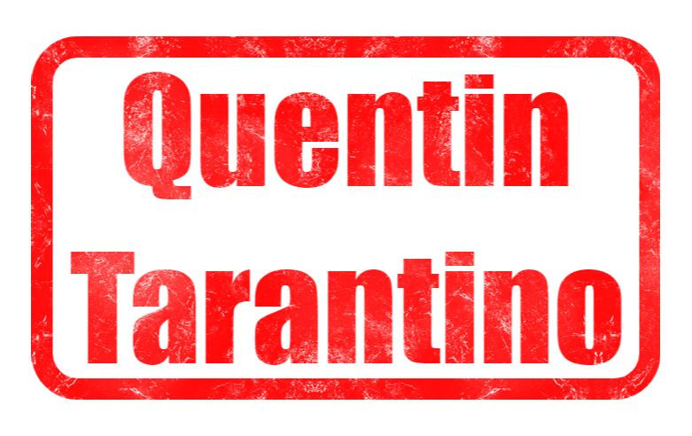

# Chiffrement symétrique

    

!!! question "Pour commencer et pour finir"

    Le texte ci-dessous a été chiffré avec Vigenère :

    **AU XPGWST SYD KTLEJTOI THN DTBYP S’DVDIPWWTH KFX HIYI AYD TCNCTELTHTM PVDCDITM BJT ZLXI MLCH ZTC, HOCVXL W’DTOGGT XF BPFTC. QYYX HITI-XF W’WDGXT SY MDCHP KDFZCIY BJX, UF CDG OT AU NWPLTIT MP UPCE AT VPGVYC STM QPXVWTH KF’XA AFXSY OPCM WP KUWATY O’DBVCT SY WP BICI TN OTH FLGBYD, RPL TA TME AT ALGSCPC SY DDC ZCTGY PI AU AGDPTSTHNT SYD TCZLCIM PVPLPH. Y’UMPINCPX UWDGM WT QLLH S’OYT IYCGXVWT RIWTGY, O’JCY GTCAPPCWP UJLTTJMP TI YQUGUJPCNP HJL WTH BZGSYD XBJTTH KFX EIFGRBLHHYYI TN CTSOTHTHE P CYLCI FPH QLPQXM OT SCPJ. TN EJ RIYCPCEGPM ADJLBJDC XDC HZB TME A’TNPGCYW FJUYS HOC IDC, D’PQUEIGU WP KYYVTUYRT XF IDOE-EJCDHPHE !**

    1. Déchiffrer le à l'aide de fonctions Python que vous aurez développées vous-même.

??? indication "Au cas où"

    J'adore Quentin Tarantino !